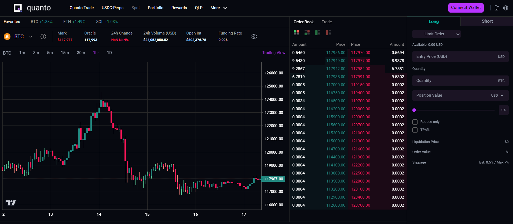
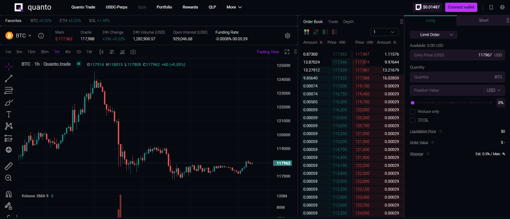

# Quanto Trade

Quanto.trade is a next-generation perpetual derivatives exchange built around cutting-edge quanto contract architecture. In this model, the underlying asset is denominated in one currency, while the derivative itself is settled in another—enabling novel exposure and capital generation mechanisms.

This repository is a frontend clone of the [Quanto Trade](https://quanto.trade/) platform, designed to replicate its user interface and functionality. The backend is a proxy to the Quanto Trade API, while the websocket communication is handled via WebSocket API.

For further details, refer to the [Quanto Trade API documentation](https://docs.quanto.trade/).

> **Note:** This project is for frontend design and learning purposes only. It makes read-only API calls to the Quanto Trade backend, and no actual trading occurs here. The Quanto Trade platforms holds the copyright to all associated assets and functionality.

## User Interface

### Cloned Quanto Trade Design



### Actual Quanto Trade Design

Note: Some differences may exist due to the use of paid TradingView charts in the original design.



## API

Upon initial load, the following API calls are made:

1. `/ticker/latest` - Retrieves all tickers with transformed data from Quanto Trade API.
2. `/candles?symbol=BTC-USD-SWAP-LIN&interval=1h&startTime=1741786231596&endTime=1742391031596` - Fetches the chart candlestick data for the specified ticker.
3. `/trades` - Retrieves recent trades for the ticker from the last 24 hours.

Subsequent real-time updates are fetched via WebSocket:

- `{"op":"subscribe","args":["ticker:app","futures/depth:BTC-USD-SWAP-LIN","trade:BTC-USD-SWAP-LIN","candles3600s:BTC-USD-SWAP-LIN","marketCap3600s:BTC-USD-SWAP-LIN"],"tag":"1755417042295"}` - Subscribe to real-time ticker, depth, trade, and candlestick data.

The WebSocket responses provide real-time updates for market data, order book depth, trades, and candlestick information.

## Architecture

1. The frontend replicates the Quanto Trade UI design.
2. The candlestick chart is rendered for markets, utilizing both REST and WebSocket APIs to fetch and stream candlestick data in real time.
3. The backend acts as a proxy to the Quanto Trade API, transforming responses to match the expected frontend format.

## Technical Specifications

- Built using **React**, **Node.js**, and **TypeScript**.
- **TradingView's [`lightweight-charts`](https://github.com/tradingview/lightweight-charts)** library is used to render the candlestick chart.
- Backend proxy server handles API transformation and CORS for Quanto Trade API integration.

## Setup and Installation

### Backend

```bash
cd backend
npm install
npm run dev
```

#### Frontend

Update `PROXY_SERVER_URL` in `frontend/src/utils/constants.ts` to `http://localhost:7000`

```
cd frontend
npm install
npm run dev
```

Go to <a>http://localhost:5173</a>
